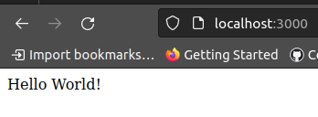
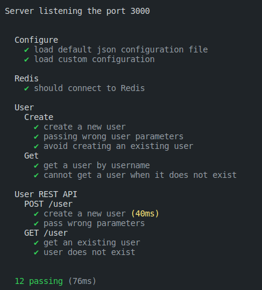
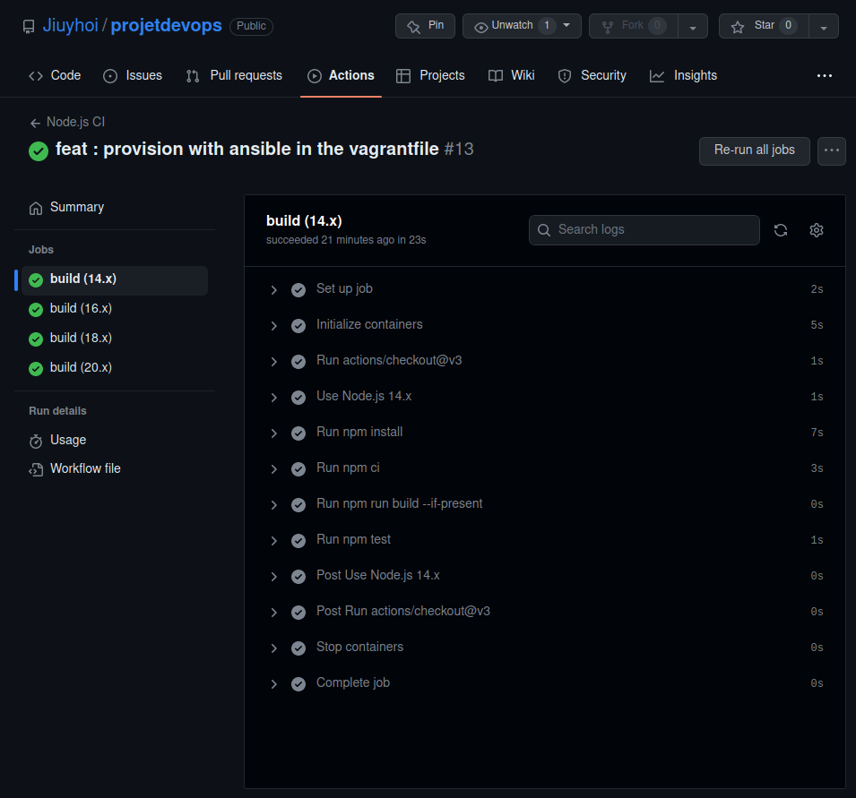
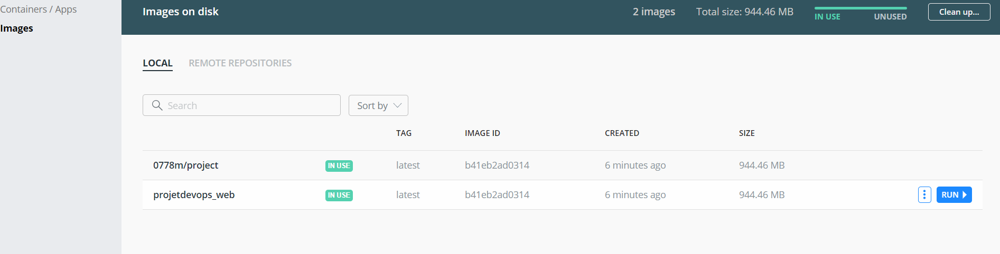
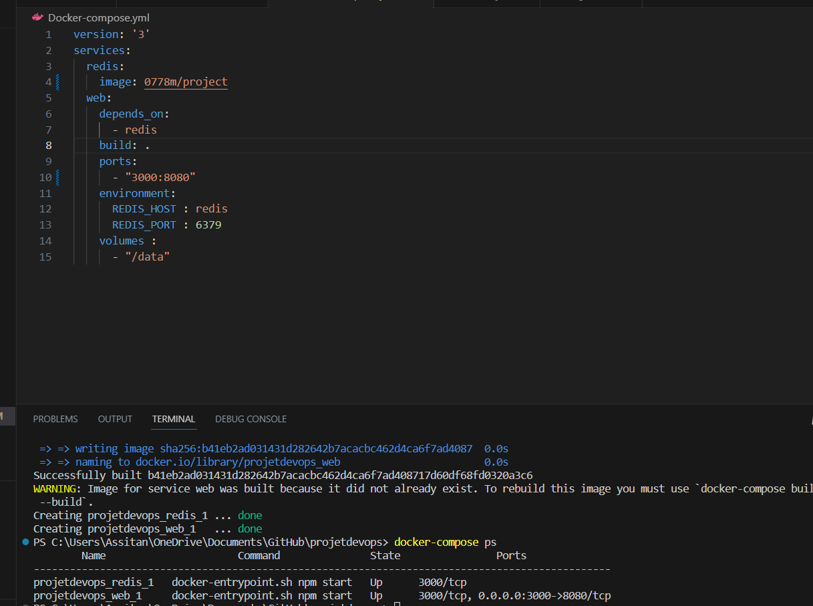

# projetdevops

Auteurs:

* Niare Assitan
* Validzhanova Anna

ING4 BDA APP

# Introduction

Ce projet a pour but d'implémenter une simple application en utilisant les outils de devops. L'application est écrite en Node.js avec l'utilisation d'une base de donnée Redis. 

Ce repository contient les éléments suivants:

* Une application avec les fonctionnalités CRUD
* Une pipeline CI/CD
* Une configuration utilisant une approche IaC 
* Une image Docker de l'application
* Une image Docker Compose

# 1. User API 

## Avant de commencer
1. Installer [Node.js](https://nodejs.org/en)
2. Installer [Redis pour Linux ou MacOS](https://redis.io/topics/quickstart)

## Installation de l'application
Dans le dossier continuous_testing/ il faut run la commande suivante pour installer l'application.

``` 
npm install
```

## Utilser l'application

``` bash
npm run start
``` 
Lorsque vous lancez l'application vous pouvez aller à l'adresse http://localhost:3000

Et vous devriez voir "Hello World !" affiché. 



Afin d'essayer l'application il faut créer un utilisateur via cette commande dans le terminal. 
```bash
curl --header "Content-Type: application/json" \
  --request POST \
  --data '{"username":"sergkudinov","firstname":"sergei","lastname":"kudinov"}' \
  http://localhost:3000/user
  ```
  Vous devriez recevoir le message suivant: 

```bash
{"status":"success","msg":"OK"}
```
De plus vous pouvez accéder à l'adresse suivante pour vérifier que le compte est bien créé, http://localhost:3000/user/sergkudinov .

## Tester l'application

Pour tester l'application il vous suffit de run 
```bash
npm test
```
Si les tests sont bien passé vous devriez avoir l'output suivant :



On peut ainsi voir que l'application est bien fonctionnelle et que nous sommes bien connecté à la base de donnée Redis.

# CI/CD pipeline

Cette partie est implémentée dans GitHub action. A chaque push du code dans GitHub un trigger est actioné. 

Tout d'abord le script installe les packages json nécessaires à l'exécution de l'application, et ensuite les tests sont lancés pour être sûr qu'il n'y a aucn bug avant le deployment.

Lorsque l'intégration est réussi en passant tous les tests, voilà c qui devrait s'afficher dans github action.



# Configuration d'une VM en utilisant l'approche IaC 

Avant de pouvoir lancer Vagrant il faut installer :
* [Vagrant](https://developer.hashicorp.com/vagrant/downloads)
* [VirtualBox](https://www.virtualbox.org/wiki/Downloads)

## Lancer la machine Vagrant
Pour lancer la machine il faut aller dans le fichier /IaC puis lancer la commande suivante dans votre terminal.

```bash
vagrant up
```
## Se connecter à la machine Vagrant

Pour entrer dans la machine Vagrant il faut la commande suivante : 

```bash
vagrant ssh
```

Vous devriez voir ceci afficher :

```bash
Last login: Sun May 14 17:06:23 2023 from 10.0.2.2
vagrant@vagrant:~$
```

Vérifions maintenant que l'application est bien dans la VM. 

```bash
vagrant@vagrant:~$ cd ../..
vagrant@vagrant:/$ cd home/
vagrant@vagrant:/home$ ls
```

Vous devriez voir afficher ceci :
```bash
continuous_testing
CHANGELOG.md  conf          package-lock.json  src
README.md     node_modules  package.json       test
```

## Ansible Provision

Dans cette partie , nous pouvons automatiser efficacement la configuration et la gestion de notre infrastructure.
Pour se faire , nous utilisons des  des playbooks et des rôles Ansible.
Nous éffectuons le healthcheck pour s'assurer de la santé de l'application.

```bash
- name: Check redis health
  uri:
    url: http://127.0.0.1/-/health
    return_content: yes
  
  register: redis_health

- name: Print redis health
  debug:
    msg: "{{ redis_health.content }}"
```
# 4.Docker
##1. Dockerfile


```bash

FROM node:16

WORKDIR /usr/src/app
COPY continuous_testing/package*.json ./
RUN npm install
COPY continuous_testing .

EXPOSE 3000
CMD [ "npm", "start" ]
```
Pour créer l'image les commandes suivantes sont à exécuter :


```bash
docker build -t 0778m/project .

```
pour verifier si l'image à bien été créer :


```bash
docker images

```


##2. Push to dockerhub


#5. Docker-compose.yml

Après avoir créer le fichier docker-compose.yml , pour vérifier qu'il fonctionne tapez dans le terminal :

```bash

docker-compose up

```
puis 

```bash
docker-compose ps

```



